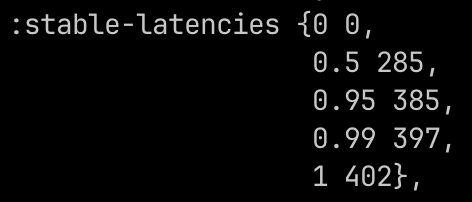
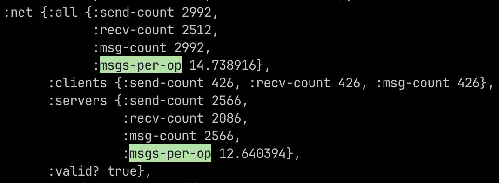

## Challenge #3d: Efficient Broadcast, Part I

[Challenge](https://fly.io/dist-sys/3d/)

In this challenge, we scale up to 25 nodes and we have constraints on the median latency to a median of 400ms and a max latency of 600ms the workload also adds a 100ms delay.
If a message that has to traverse to 5+ nodes we know that that will go over our max latency constraint, the last constraint is that we have to have less than 30 messages per operation.

With this in mind I decided to no longer use the provided topology and instead use a star topology, this way all nodes will broadcast to the same node and then this hub will send the cached messages in batches to the other nodes reducing the number of messages per operation and latency.

With this approach we got a max latency of 402ms and a max of ~14 messages per operation

**Latencies**

**Messages per operation**

