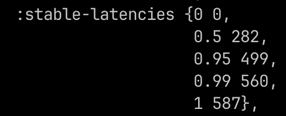
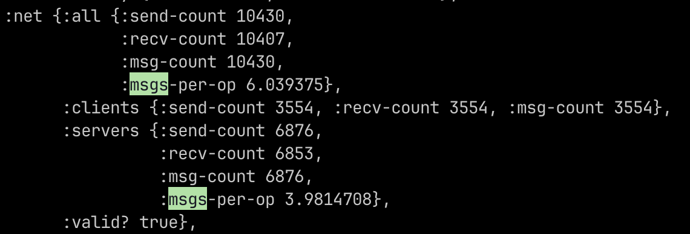

## Challenge #3e: Efficient Broadcast, Part II

[Challenge](https://fly.io/dist-sys/3e/)

The goal of this challenge is to improve the previous solution, the constraints dictate that we have a maximum of 20 messages per operation which is less than the number of nodes, the median latency has to be below 1 second and maximum below 2 seconds
With the previous implementation we were already hitting all the requirements just for testing purposes I changed the `batchInterval` to 400ms and that reduces the messages per operation to ~6

**Latencies**

**Messages per operation**

